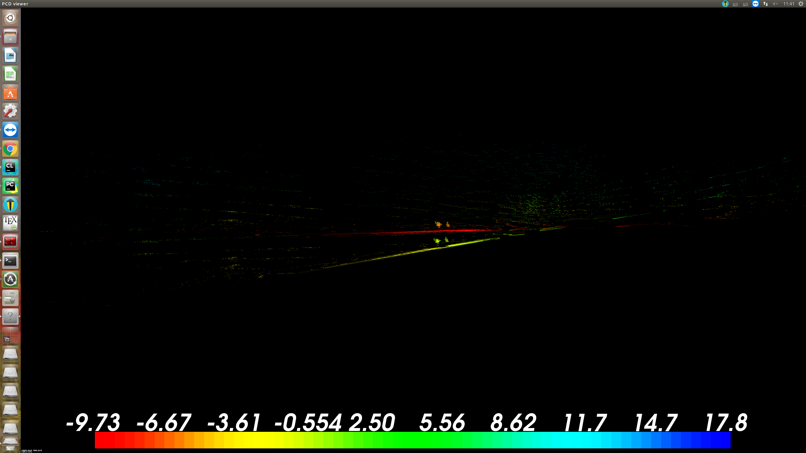

# point_to_GND
#1. Introduction
This is used to transform the LiDAR scan to the ground.
#2. 总结
感觉对于空旷平面还是ransac好一点,城市环境的话还是论文里面的方法OK一点.
#3. How to use and result.
Put the pcd file into the folder of build folder, then run it. You will see the result below, the red one is the point moved to the groudd.
